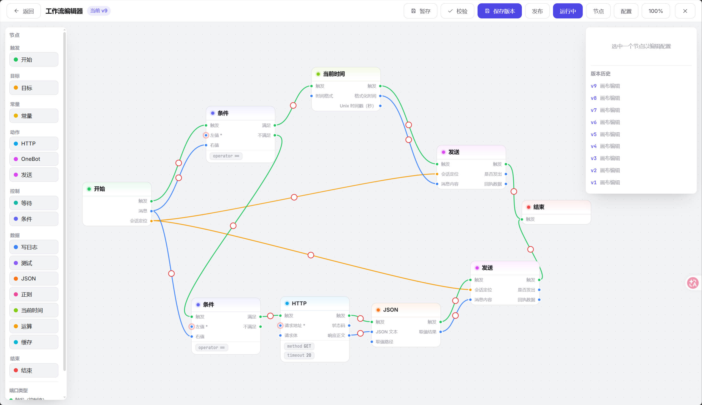

# BotNode

[](https://github.com/bitbad1024/BotNode/actions/workflows/ci.yml)
[](LICENSE)


BotNode 是一个可以自己部署的机器人框架。它在三件事上做了抽象：

- **流程**：触发（收到消息 / 到了时间点）→ 加工（取字段、正则、算一算、判条件）→ 动作（回消息、调接口），全部在画布上连线完成。
- **平台**：OneBot、Kook 的差别被抹平成同一套「规范化事件 + 能力协议」。
- **地基**：异步日志（可检索、可多出口）、缓存（Redis 和进程内一套 API）、定时任务（cron，红黑树排程），开箱即用。

技术栈：后端 Python 3.12+（FastAPI / SQLModel），控制台 React + TypeScript。



## 启动

```bash
python -m venv .venv && .venv\Scripts\activate     # Windows
copy config.toml.example config.toml               # 改成自己的配置
python app.py                                      # 后端 http://127.0.0.1:18080
cd frontend && npm install && npm run dev          # 控制台 http://127.0.0.1:15173
```

Windows 也可以直接双击 `start-all.bat`。

数据库可选：sqlite、mariadb；

缓存可选：redis、内存

## 测试

```bash
pytest
```

## 前端打包

```bash
cd frontend && npm install && npm run build
```

## 本地账号

本地试用账号（由 `botnode/api/services/user/demo.py` 写入，**部署到公网前务必删除或改密码**）：

| 账号 | 密码 | 角色 |
|---|---|---|
| `admin` | `botnode-admin` | 管理员 |
| `robot` | `botnode-robot` | 普通用户 |
| `guest` | `botnode-guest` | 只读 |

## 现在支持什么

| 平台 | 连接方式 | 备注 |
|---|---|---|
| OneBot | 反向 WebSocket | 框架做服务端（默认 16700），实现端连进来，靠握手令牌认归属 |
| Kook | 正向 WebSocket | 框架做客户端，用 Bot Token 连网关；发消息走 REST |

这两个平台一正一反，正好验证了抽象是否站得住。加第三个平台只需要：写一个适配器（实现 `BotAdapter` 协议）+ 在 `bootstrap.py` 里装配一行，**接口层和工作流一行都不用改**。做法见 [docs/bridge/bridge.md](docs/bridge/bridge.md)。

内置工作流节点：`start` / `end`、`log`、`test`、`constant`、`http`、`delay`、`json`、`regex`、`now`、`condition`、`send`、`onebot`、`operator`、`cache`、`target`。

三个运行规则值得记住：

- **值沿边流**：节点产出按输出端口名往下传，下游按入边接收，没有全局变量。
- **执行看控制流**：节点要不要跑只看 `trigger` 入边 —— 数据边（`message` / `target`）只送值，
  所以分流没走中的分支不会因为一条跨分支的数据边而误跑。
- **失败分两类**：业务失败（算不出、取不到、对方报错）抛 `NodeFailure`，只停当前分支，别的支路照跑；环境问题（连不上、没接线、缺依赖）抛普通异常，整条流程中断并留下堆栈。

自己写节点、写契约、写校验规则，见 [docs/workflow/workflow.md](docs/workflow/workflow.md)。

## 接下来想做的

- 更多平台：Discord、Telegram、钉钉、Slack……
- 节点市场
- 可视化调试：断点、单步、值预览
- 插件机制，节点和适配器能以独立包发布

## 想一起来？

欢迎提 Issue，也欢迎直接发 PR。

- 加平台 → 实现 `BotAdapter`，补文档。
- 加节点 → 一个文件，注册一下，框架不用动。
- 文档、bugfix、想法。

架构细节从 [docs/README.md](docs/README.md) , [examples/](examples/) 示例。

## 文档

- [docs/README.md](docs/README.md)：框架总览与文档索引（分层、依赖方向、装配链路、配置、可选依赖）
- [docs/workflow/workflow.md](docs/workflow/workflow.md)：工作流模块索引、写自己的节点（第 5 节）、**从画布到运行：保存版本 → 发布 → 运行开关**（第 8 节）
- 其余模块文档：[logger](docs/logger/logger.md) · [scheduler](docs/scheduler/scheduler.md) · [cache](docs/cache/cache.md) · [bridge](docs/bridge/bridge.md)
- [examples/](examples/)：可直接运行的最小示例

## 参与

- [CONTRIBUTING.md](CONTRIBUTING.md)：环境准备、目录速览、代码约定、测试与提交规范
- [CODE_OF_CONDUCT.md](CODE_OF_CONDUCT.md)：社区行为准则
- [SECURITY.md](SECURITY.md)：漏洞报告渠道与部署注意事项
- [THIRD_PARTY_NOTICES](THIRD_PARTY_NOTICES)：第三方组件与许可

## 许可证

[MIT](LICENSE) © 2026 BotNode 贡献者
